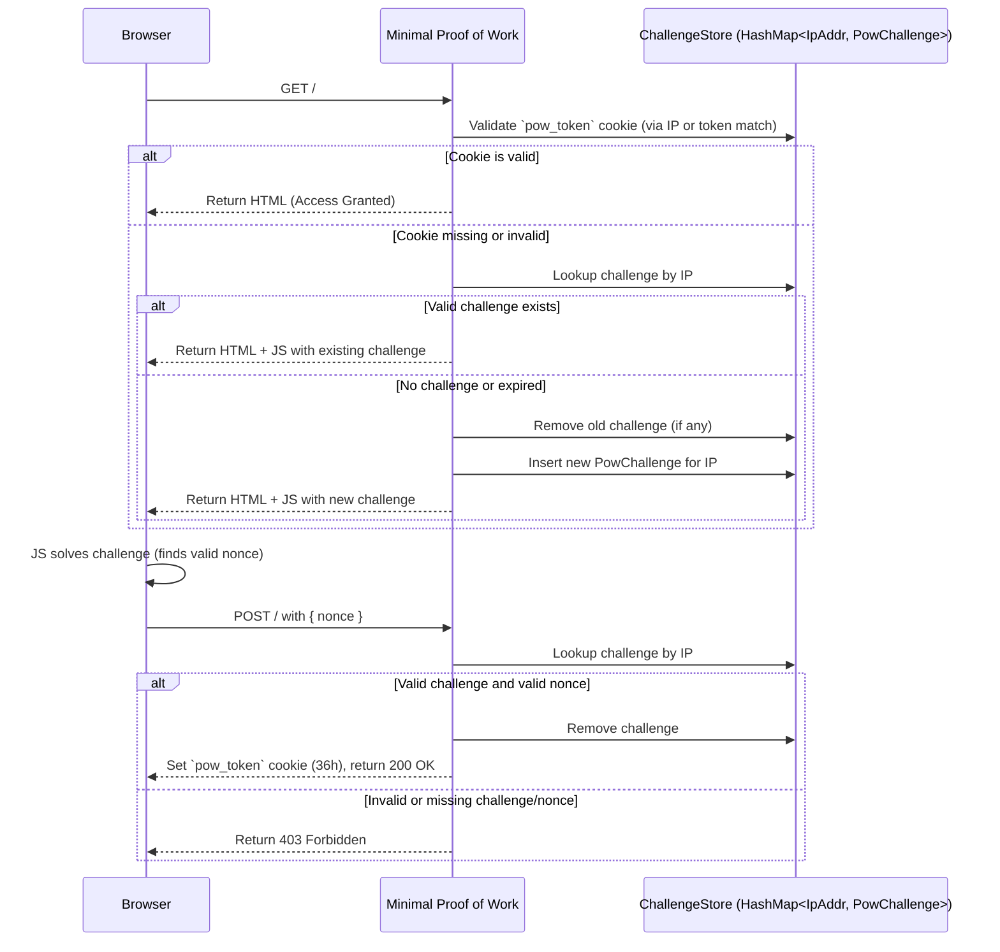

# mpow
🚀 Minimal Proof of Work ⛏️ 🦀 Written in Rust | 🐳 Dockerized

```mermaid
sequenceDiagram
  participant Browser as Browser
  participant Server as Minimal Proof of Work
  participant Store as ChallengeStore (HashMap<IpAddr, PowChallenge>)

  Browser ->> Server: GET /
  Server ->> Store: Validate `pow_token` cookie (via IP or token match)
  alt Cookie is valid
    Server -->> Browser: Return HTML (Access Granted)
  else Cookie missing or invalid
    Server ->> Store: Lookup challenge by IP
    alt Valid challenge exists
      Server -->> Browser: Return HTML + JS with existing challenge
    else No challenge or expired
      Server ->> Store: Remove old challenge (if any)
      Server ->> Store: Insert new PowChallenge for IP
      Server -->> Browser: Return HTML + JS with new challenge
    end
  end

  Browser ->> Browser: JS solves challenge (finds valid nonce)
  Browser ->> Server: POST / with { nonce }

  Server ->> Store: Lookup challenge by IP
  alt Valid challenge and valid nonce
    Server ->> Store: Remove challenge
    Server -->> Browser: Set `pow_token` cookie (36h), return 200 OK
  else Invalid or missing challenge/nonce
    Server -->> Browser: Return 403 Forbidden
  end

```
