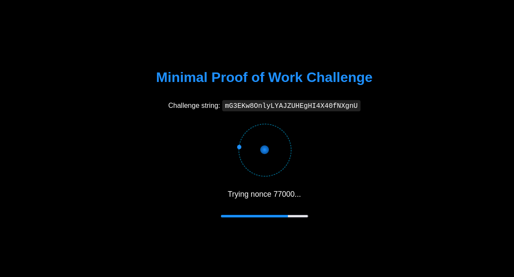
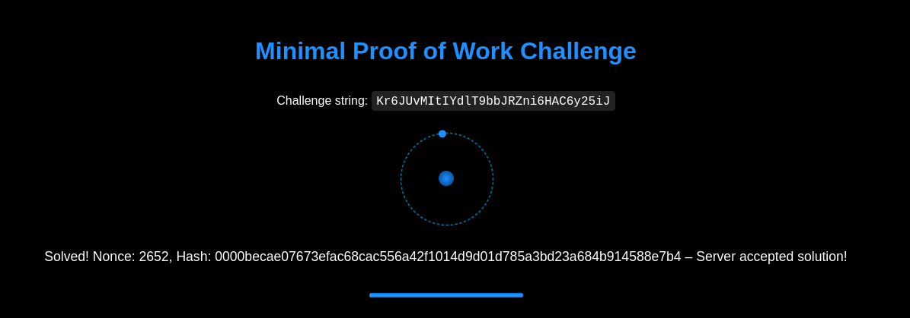
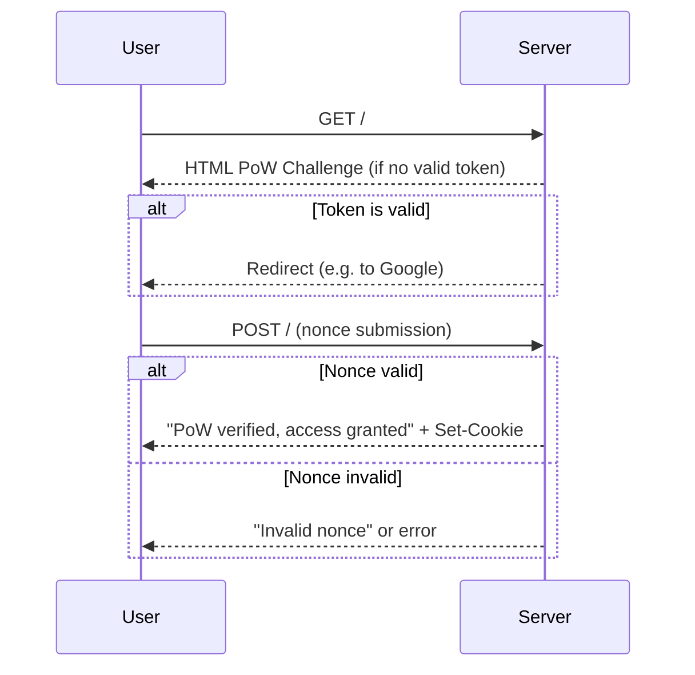
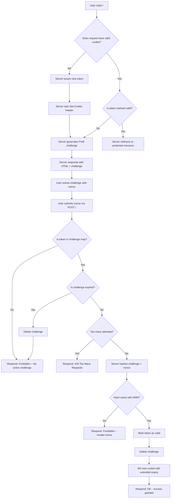

# Minimal Proof of Work
🚀 Minimal Proof of Work ⛏️ 🦀 Written in Rust 

### How it Works:

```mermaid
sequenceDiagram
    participant User
    participant Server

    User->>Server: GET /
    Server-->>User: HTML PoW Challenge (if no valid token)
    alt Token is valid
        Server-->>User: Redirect (e.g. to Google)
    end

    User->>Server: POST / (nonce submission)
    alt Nonce valid
        Server-->>User: "PoW verified, access granted" + Set-Cookie
    else Nonce invalid
        Server-->>User: "Invalid nonce" or error
    end
```
### In details:

```mermaid
graph TD
    A[User visits /] --> B{Does request have valid cookie?}

    B -- No --> C[Server issues new token]
    C --> D[Server sets Set-Cookie header]
    D --> E[Server generates PoW challenge]
    E --> F[Server responds with HTML + challenge]

    B -- Yes --> G{Is token marked valid?}
    G -- No --> E
    G -- Yes --> H[Server redirects to protected resource]

    F --> I[User solves challenge with nonce]
    I --> J[User submits nonce via POST /]

    J --> K{Is token in challenge map?}
    K -- No --> L[Respond: Forbidden – No active challenge]

    K -- Yes --> M{Is challenge expired?}
    M -- Yes --> N[Delete challenge] --> L

    M -- No --> O{Too many attempts?}
    O -- Yes --> P[Respond: 429 Too Many Requests]

    O -- No --> Q[Server hashes challenge + nonce]
    Q --> R{Hash starts with 0000?}

    R -- No --> S[Respond: Forbidden – Invalid nonce]

    R -- Yes --> T[Mark token as valid]
    T --> U[Delete challenge]
    U --> V[Set new cookie with extended expiry]
    V --> W[Respond: OK – Access granted]

```
