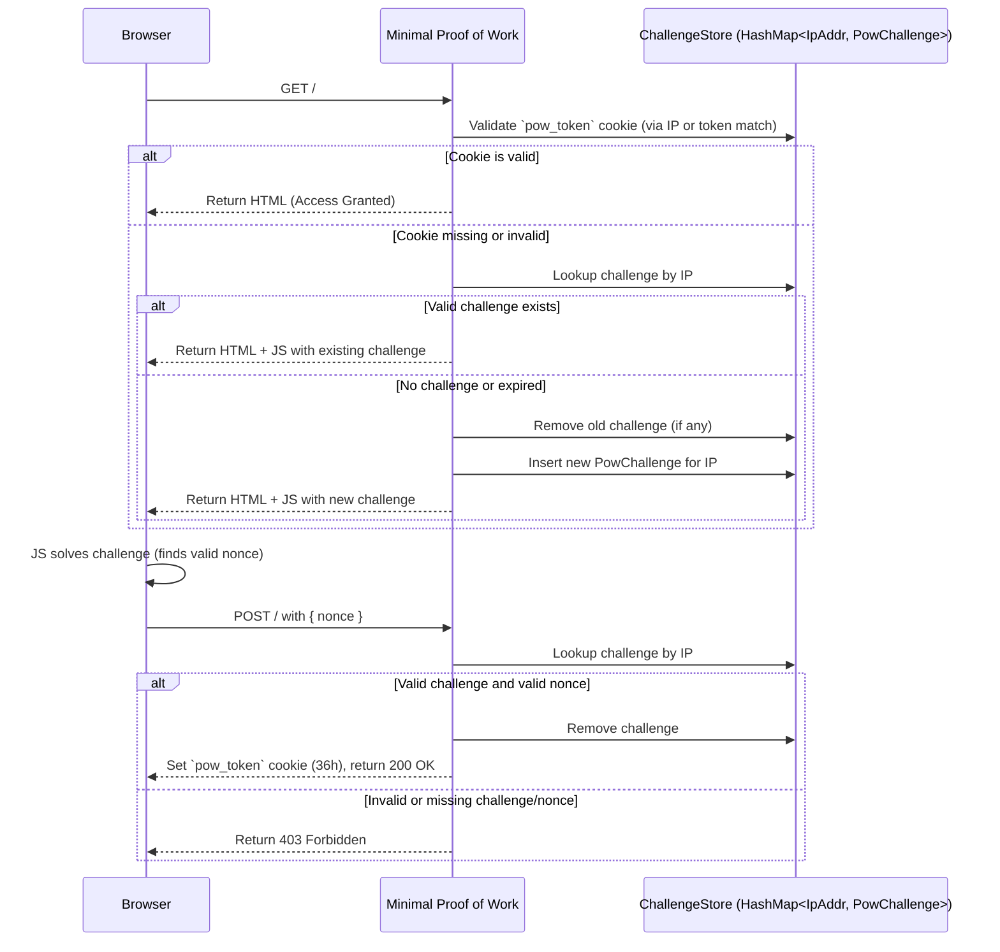
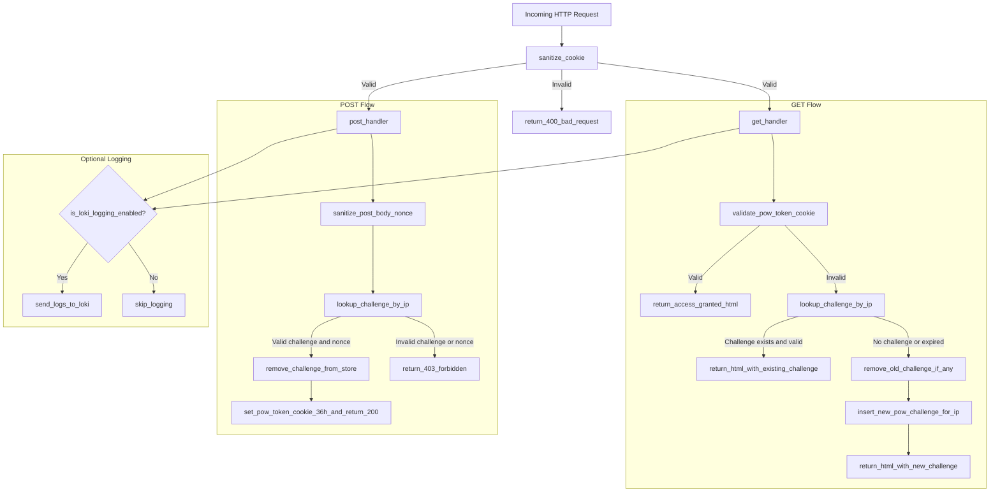

# Minimal Proof of Work
🚀 Minimal Proof of Work ⛏️ 🦀 Written in Rust | 🐳 Dockerized
### How it Works:

```mermaid
sequenceDiagram
  participant Browser as Browser
  participant Server as Minimal Proof of Work
  participant Store as ChallengeStore (HashMap<IpAddr, PowChallenge>)

  Browser ->> Server: GET /
  Server ->> Store: Validate `pow_token` cookie (via IP or token match)
  alt Cookie is valid
    Server -->> Browser: Return HTML (Access Granted)
  else Cookie missing or invalid
    Server ->> Store: Lookup challenge by IP
    alt Valid challenge exists
      Server -->> Browser: Return HTML + JS with existing challenge
    else No challenge or expired
      Server ->> Store: Remove old challenge (if any)
      Server ->> Store: Insert new PowChallenge for IP
      Server -->> Browser: Return HTML + JS with new challenge
    end
  end

  Browser ->> Browser: JS solves challenge (finds valid nonce)
  Browser ->> Server: POST / with { nonce }

  Server ->> Store: Lookup challenge by IP
  alt Valid challenge and valid nonce
    Server ->> Store: Remove challenge
    Server -->> Browser: Set `pow_token` cookie (36h), return 200 OK
  else Invalid or missing challenge/nonce
    Server -->> Browser: Return 403 Forbidden
  end

```
### Request Handling Flow:

```mermaid
graph TD
  A[Incoming HTTP Request] --> S[sanitize_cookie]
  S -->|Valid| B[get_handler]
  S -->|Valid| C[post_handler]
  S -->|Invalid| X[return_400_bad_request]

  subgraph GET Flow
    B --> D[validate_pow_token_cookie]
    D -->|Valid| E[return_access_granted_html]
    D -->|Invalid| F[lookup_challenge_by_ip]
    F -->|Challenge exists and valid| G[return_html_with_existing_challenge]
    F -->|No challenge or expired| H[remove_old_challenge_if_any]
    H --> I[insert_new_pow_challenge_for_ip]
    I --> J[return_html_with_new_challenge]
  end

  subgraph POST Flow
    C --> O["sanitize_post_body_nonce"]
    O --> K[lookup_challenge_by_ip]
    K -->|Valid challenge and nonce| L[remove_challenge_from_store]
    L --> M["set_pow_token_cookie_36h_and_return_200"]
    K -->|Invalid challenge or nonce| N[return_403_forbidden]
  end

  subgraph Optional Logging
    B --> P{is_loki_logging_enabled?}
    C --> P
    P -->|Yes| Q[send_logs_to_loki]
    P -->|No| R[skip_logging]
  end
```
