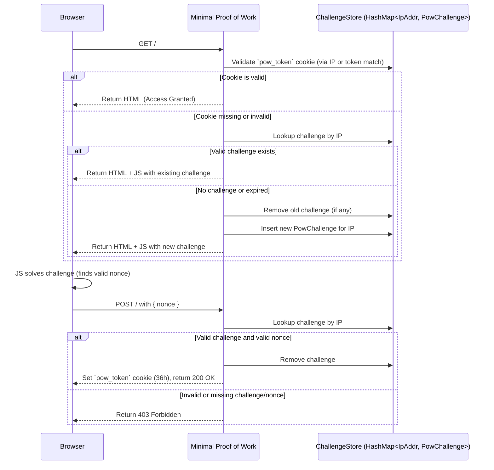
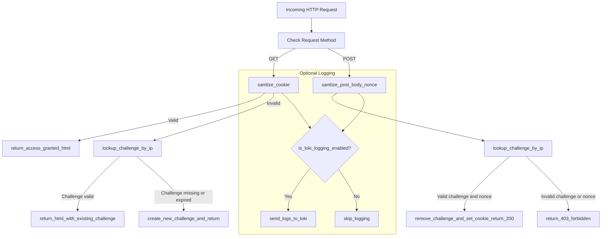

# Minimal Proof of Work
🚀 Minimal Proof of Work ⛏️ 🦀 Written in Rust 

### How it Works:

```mermaid
sequenceDiagram
  participant Browser as Browser
  participant Server as Minimal Proof of Work
  participant Store as ChallengeStore (HashMap<IpAddr, PowChallenge>)

  Browser ->> Server: GET /
  Server ->> Store: Validate `pow_token` cookie (via IP or token match)
  alt Cookie is valid
    Server -->> Browser: Return HTML (Access Granted)
  else Cookie missing or invalid
    Server ->> Store: Lookup challenge by IP
    alt Valid challenge exists
      Server -->> Browser: Return HTML + JS with existing challenge
    else No challenge or expired
      Server ->> Store: Remove old challenge (if any)
      Server ->> Store: Insert new PowChallenge for IP
      Server -->> Browser: Return HTML + JS with new challenge
    end
  end

  Browser ->> Browser: JS solves challenge (finds valid nonce)
  Browser ->> Server: POST / with { nonce }

  Server ->> Store: Lookup challenge by IP
  alt Valid challenge and valid nonce
    Server ->> Store: Remove challenge
    Server -->> Browser: Set `pow_token` cookie (36h), return 200 OK
  else Invalid or missing challenge/nonce
    Server -->> Browser: Return 403 Forbidden
  end

```
### Request Handling Flow:

```mermaid
graph TD
  A[Incoming HTTP Request] --> B[Check Request Method]
  
  B -->|GET| C[sanitize_cookie]
  C -->|Valid| D[return_access_granted_html]
  C -->|Invalid| E[lookup_challenge_by_ip]
  E -->|Challenge valid| F[return_html_with_existing_challenge]
  E -->|Challenge missing or expired| G[create_new_challenge_and_return]
  
  B -->|POST| H[sanitize_post_body_nonce]
  H --> I[lookup_challenge_by_ip]
  I -->|Valid challenge and nonce| J[remove_challenge_and_set_cookie_return_200]
  I -->|Invalid challenge or nonce| K[return_403_forbidden]
  
  subgraph Optional Logging
    C --> L{is_loki_logging_enabled?}
    H --> L
    L -->|Yes| M[send_logs_to_loki]
    L -->|No| N[skip_logging]
  end
```
