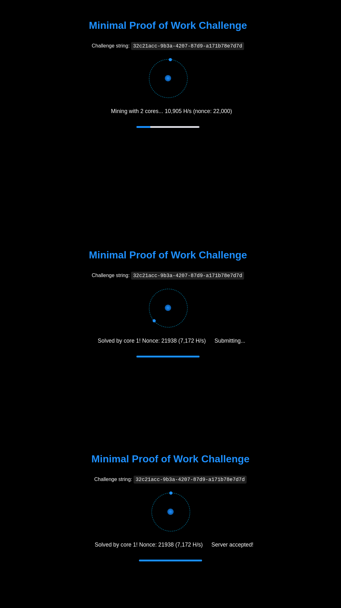
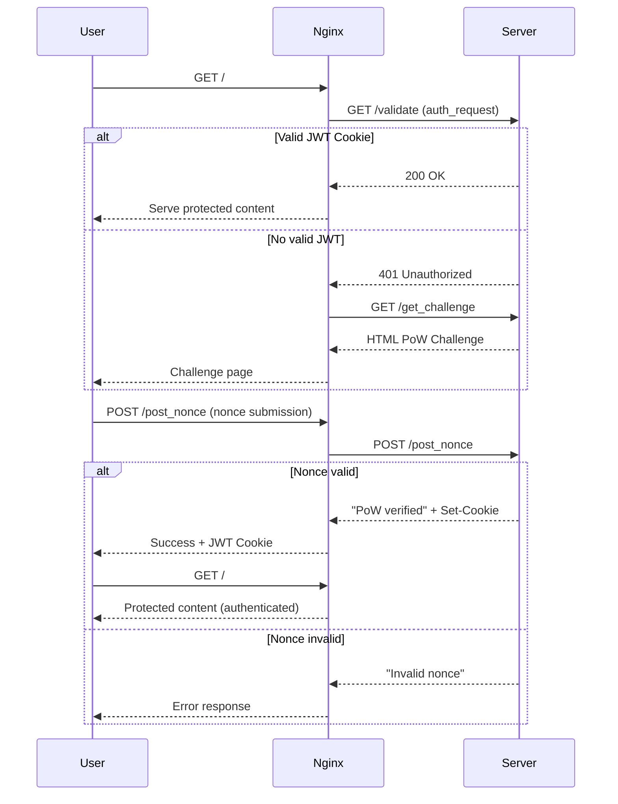
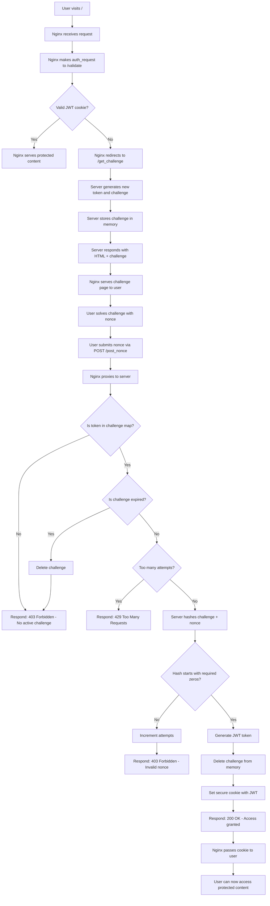

# Minimal Proof of Work
🚀 Minimal Proof of Work ⛏️ 🦀 Written in Rust 



### How it Works:


### In details:


## 🐳 Docker Deployment

### Architecture
The application uses a multi-container setup with Docker Compose:

- **mpow-auth**: Rust application container (authentication service)
- **nginx**: Reverse proxy with auth_request module for protection
- **mpow-network**: Bridge network for container communication

### Quick Start

```bash
docker-compose up -d
```

```bash
curl http://localhost
```

### Container Details

#### 1. Rust Application Container (`mpow-auth`)
- **Base Image**: `rust` (multi-stage build)
- **Build Stage**: Compiles the Rust application
- **Runtime Stage**: Runs the compiled binary
- **Port**: 3000 (internal)
- **Environment**: `RUST_LOG=info`

#### 2. Nginx Reverse Proxy (`mpow-nginx`)
- **Base Image**: `nginx:alpine`
- **Ports**: 80 (HTTP), 443 (HTTPS)
- **Features**:
  - `auth_request` module for authentication
  - Reverse proxy to Rust backend
  - Static file serving for protected content

### File Structure
```
.
├── Dockerfile                 # Multi-stage Rust build
├── docker-compose.yml         # Container orchestration
├── nginx/
│   ├── nginx.conf            # Nginx configuration
│   ├── html/
│   │   └── private/
│   │       └── index.html    # Protected content
└── src/                      # Rust source code
```

### Nginx Configuration Highlights

#### Authentication Flow
```nginx
location / {
    auth_request /validate;           # Check authentication
    error_page 401 = /get_challenge;  # Redirect if unauthorized
    try_files /private/index.html =404;
}
```

#### Internal Validation
```nginx
location = /validate {
    internal;                         # Internal use only
    proxy_pass http://mpow-auth/validate;
    proxy_pass_request_body off;
    proxy_set_header Cookie $http_cookie;
}
```

#### Challenge & Nonce Handling
```nginx
location = /get_challenge {
    proxy_pass http://mpow-auth/get_challenge;
    proxy_pass_header Set-Cookie;     # Pass JWT cookies
}

location = /post_nonce {
    proxy_pass http://mpow-auth/post_nonce;
    proxy_pass_header Set-Cookie;     # Pass JWT cookies
}
```

### Ports

| Service | Internal Port | External Port | Description |
|---------|---------------|---------------|-------------|
| mpow-auth | 3000 | - | Rust authentication service |
| nginx | 80 | 80 | HTTP web server |

### Development

#### Build and run locally:
```bash
docker-compose up --build
```

#### View logs:
```bash
docker-compose logs -f mpow-auth
docker-compose logs -f nginx
```

#### Stop services:
```bash
docker-compose down
```

### API Endpoints:
- `GET /` - Protected content (requires authentication)
- `GET /get_challenge` - Returns HTML page with PoW challenge
- `POST /post_nonce` - Submit nonce solution for verification  
- `GET /validate` - Internal endpoint for nginx auth_request

### Security Features:
- JWT tokens with expiration
- Challenge expiration (prevents replay attacks)
- Rate limiting (max attempts per challenge)
- Secure HTTP-only cookies
- CSRF protection via SameSite cookies
- Nginx reverse proxy protection
- Internal-only validation endpoints
