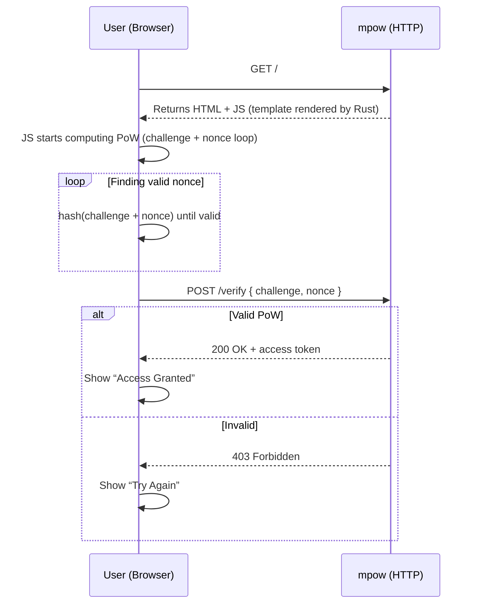

# mpow
🚀 Minimal Proof of Work ⛏️ 🦀 Written in Rust | 🐳 Dockerized

```mermaid
sequenceDiagram
  participant User as User (Browser)
  participant Server as mpow (HTTP)

  User ->> Server: GET /<br>
  Server -->> User: Returns HTML + JS (template rendered by Rust)
  User ->> User: JS starts computing PoW (challenge + nonce loop)
  loop Finding valid nonce
    User ->> User: hash(challenge + nonce) until valid
  end
  User ->> Server: POST /verify { challenge, nonce }
  alt Valid PoW
    Server -->> User: 200 OK + access token
    User ->> User: Show “Access Granted”
  else Invalid
    Server -->> User: 403 Forbidden
    User ->> User: Show “Try Again”
  end
```
